> **EGNSS4ALL User Guide**
>
> Version September
> 2023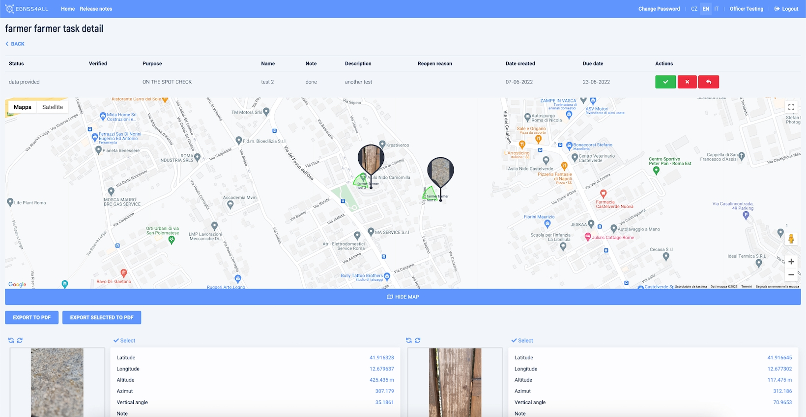

# Table of Contents

[**1. Mobile Application - Android 4**](#mobile-application---android)

> [1.1 Installation 4](#installation)
>
> [1.1.1 Installation from app store 4](#installation-from-app-store)
>
> [1.1.2 Installing from APK 4](#installing-from-apk)
>
> [1.1.3 Compiling from source code 4](#compiling-from-source-code)
>
> [1.1.4 Minimum requirements 5](#minimum-requirements)
>
> [1.2 Application Start and Permissions
> 5](#application-start-and-permissions)
>
> [1.2.1 Login 7](#login)
>
> [1.3 Main Screen 9](#main-screen)
>
> [1.3.1 Traffic Lights 10](#traffic-lights)
>
> [1.3.2 User functions 11](#user-functions)
>
> [1.3.3 Task List 12](#task-list)
>
> [1.3.4 Task detail 13](#task-detail)
>
> [1.3.5 Standalone Snapshots 16](#standalone-snapshots)
>
> [1.3.6 Camera Mode 18](#camera-mode)
>
> [1.3.7 Map 20](#map)
>
> [1.3.8 Paths 22](#)
>
> [1.3.9 GNSS Raw Data 23](#gnss-raw-data)
>
> [1.3.10 GNSS SkyMap 25](#)
>
> [1.4 About 26](#about)
>
> [1.5 Settings 27](#settings)
>
> [1.6 Offline Usage 29](#)

[**2. Mobile Application - iOS 30**](#)

> [2.1 Installation 30](#installation-1)
>
> [2.1.1 Installation from App Store or via TestFlight
> 30](#installation-from-app-store-or-via-testflight)
>
> [2.1.2 Compiling from source code 30](#compiling-from-source-code-1)
>
> [2.1.3 Minimum requirements 30](#minimum-requirements-1)
>
> [2.2 Application Start and Permissions
> 30](#application-start-and-permissions-1)
>
> [2.2.1 Login 31](#login-1)
>
> [2.3 Main Screen 33](#)
>
> [2.3.1 Task List 35](#task-list-1)
>
> [2.3.2 Task detail 36](#task-detail-1)
>
> [2.3.3 Standalone Snapshots 39](#standalone-snapshots-1)
>
> [2.3.4 Camera Mode 41](#camera-mode-1)
>
> [2.4 Map 43](#)
>
> [2.4.1 Paths 44](#paths-1)
>
> [2.4.2 GNSS SkyMap 45](#gnss-skymap-1)
>
> [2.5 About 46](#)
>
> [2.6 Settings 47](#settings-1)
>
> [2.7 Offline Usage 48](#)

[**3. Web Console Interface 49**](#web-console-interface)

> [3.1 User roles 49](#user-roles)
>
> [3.2 Change Password 50](#change-password)
>
> [3.3 User access 51](#)
>
> [3.3.1 Task List 51](#task-list-2)
>
> [3.3.2 Task Detail page 53](#)
>
> [3.3.3 Standalone photos gallery 54](#standalone-photos-gallery)
>
> [3.3.4 Photo gallery 57](#photo-gallery)
>
> [3.3.5 User paths 58](#user-paths)
>
> [3.3.6 Generating PDF documents 59](#generating-pdf-documents)
>
> [3.3.7 Map 62](#map-2)
>
> [3.4 Administrator 64](#administrator)
>
> [3.4.1 User management 64](#user-management)
>
> [3.4.2 User Detail 66](#user-detail)
>
> [3.4.3 Task Detail 68](#task-detail-2)
>
> [3.5 Super-administrator 70](#super-administrator)
>
> [3.5.1 Agency list 70](#agency-list)
>
> [3.5.2 Agency detail 71](#agency-detail)

[**4. Annex: Hosting and installing the EGNSS4ALL web console
73**](#annex-hosting-and-installing-the-egnss4all-web-console)

> [4.1 Hosting requirements 73](#hosting-requirements)
>
> [4.2 Server resources requirements 73](#server-resources-requirements)
>
> [4.3 Installation steps for the webconsole
> 73](#installation-steps-for-the-webconsole)

1.  # Mobile Application - Android

    1.  ## Installation 

        1.  ### Installation from app store

The application for Android phones is distributed via Google Play Store
service.

The application is currently in the Closed Testing Alpha channel (status
27/06/2022). Each user has to be registered with their Google Account.

The production version will be released to the production channel in the
future without the limitation mentioned above.

### Installing from APK

Follow these steps to install the application from an apk file. The
details of these steps will vary depending on your version of Android
and the manufacturer of your device.

1.  Download the apk file (package) to your phone either by transferring
    > files via PC or via a mobile web browser

2.  Make sure in the settings according to your version of Android that
    > you are allowed to install third-party applications

3.  Use the embedded file manager application on your mobile device,
    > where the apk file is stored, or download such an application

4.  Once you find the apk in the file manager, tap on it to install

5.  Follow the instructions in the dialog that appears until the
    > installation is successful

    1.  ### Compiling from source code

The source code and the directory structure are compatible and meet the
requirements for the Android Studio project in which it was created.

You must have Android Studio installed on your PC to compile the
application. Android Studio can be downloaded here:
[<u>https://developer.android.com/studio</u>](https://developer.android.com/studio).

You also need to have Gradle build automation tools, at least version
4.1.2, running in the Android Studio.

To build and run an application, open the source code of the application
as an Android Studio project and execute the build command and then
execute the run command. At the same time, you must also have downloaded
all the dependencies and libraries that are ordered by the gradle
configuration files.

More detailed information on how to compile and work with source codes
in Android Studio can be found here:
[<u>https://developer.android.com/studio/run</u>](https://developer.android.com/studio/run).

### Minimum requirements

Android:

-   Minimal version of Android: 7.0 (API 24)

-   Disk space: 100MB (only a standalone application without a large
    > amount of user data)

-   RAM: 1GB

-   Sensors: gyroscope, magnetometer, accelerometer

-   Inputs: camera, Wi-Fi or data mobile service, location service

-   Apps: Google Play services

    1.  ## Application Start and Permissions

The application can be run on Android devices by selecting it in the
list of applications.

**Application icon**

Upon the first start of the application, user permissions will be
requested, which are required to correctly run the application.

-   Location services

    -   to assign location data to photos

    -   to distinguish between various types of location data or signals
        > on the device

    -   to use the path tracking feature

-   Camera and Video

    -   to use the device camera for the snapshot capturing feature

-   Make and manage calls

    -   to assign data of the mobile network or the WIFI network to
        > captured snapshots as input to geotagged information

In the case that any of mentioned permissions is not allowed by the
user, the application is not able to work properly. Thus, the dialog
requesting such permissions is shown to the user (Fig. 1). A user is
able to invoke the Android system permissions dialog again by clicking
the “*Confirm Permissions*“ button. If these dialogs have been banned by
the user, there is still the possibility to set permissions in the
System settings before the application start. This procedure may vary on
different Android devices and system versions.

**Fig. 1 Permissions request**

### Login

After the first launch of the application and granting all the necessary
permissions to the application, the user will be presented with a login
screen (Fig. 2), where the assigned login and password will need to be
filled out.

Click the *Sign In* button to complete the login.

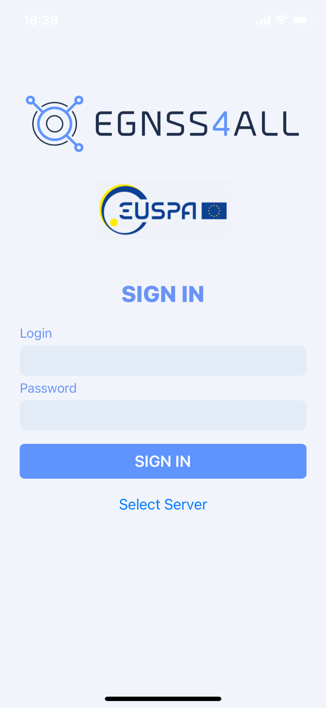

**Fig. 2 Login screen**

The Select Server button allows you to choose the backoffice server to
use. It is possible to use the default one or your own.

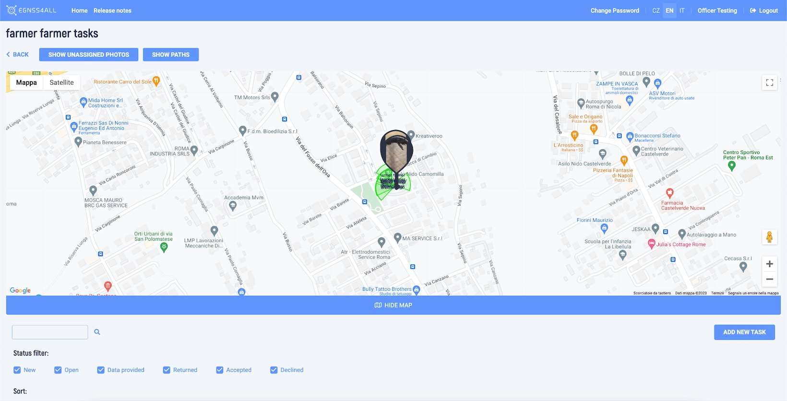

**Fig. 3 Select Server**

To successfully log in, all data most be entered correctly and the
device should be connected to the Internet at the time of login. The
login details will be remembered for future uses of the app. Re-login
will be required only after explicit logout of the user. After each
login, the synchronization process (*Main screen*) starts automatically.

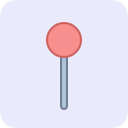

**Fig. 4 Synchronization**

The synchronization process allows you to align information between
backoffice server and apps

## Main Screen

In the upper section of the Main screen, the “Logged in user” field can
be found, which provides information about the currently logged in user.

The attributes of the host device are displayed in the middle of the
“Basic Information” section. Traffic lights are displayed next to some
of the attributes. Their detailed description is given in the sidebar
and can also be found in the *About screen*.

**Fig. 5 Main screen**

### Traffic Lights

Device capabilities show the current ability of the device to receive
location data. Green indicates the active ability of the phone to
determine its current location. Red means an inability to determine your
current position. If this is the case, location services on the device
may be disabled. Other attributes use the green or yellow color. Green
indicates that the device has that particular property. Yellow indicates
that the device does not have the given property or has not yet been
able to verify the given availability and may change to green over time.
Other items representing the individual properties of the device, which
are listed below, can only be green or yellow. Each yellow item may
change to green over time. The opposite statement does not apply, and
the green item will remain green forever.

### User functions 

To navigate between the different application modules, a main menu opens
when you click on the three dots in the upper right corner of the
screen. The context menu has the following options:

-   Synchronize

    -   Starts the process of synchronizing data with the server. You
        > cannot use the application during synchronization and you must
        > be connected to the internet.

<!-- -->

-   Task Overview

    -   Displays the task list screen

-   Unassigned Photos

    -   Displays the list of standalone photos, which are not assigned
        > to the specific task

-   Map

    -   Changes the screen to the map view with all taken photos

-   Path Tracking

    -   Changes the screen to the map view for taking new paths or
        > viewing paths that have already been taken

-   Settings

    -   Allows the user to change the settings

-   GNSS Raw Data

    -   Displays an overview of currently received GNSS data

-   About

    -   Shows basic information about the application

-   Log out

    -   User log out, reverts to the login screen

        1.  ### Task List

In the task overview (Fig. 5), user tasks are listed by name, status,
number of captured images, creation date and due date. By clicking on a
specific task, a screen with details and options to edit is displayed.

**Fig. 6 Task list  
**

The go-up filter (by tapping the Filter bar at the top of the screen)
restricts the task list by task name and status. In the filter, you can
also set the sorting of images in the list according to the options
offered. When the *Expired* option is selected, the sort is divided into
two depending on whether the due date has passed or not. The sorted list
of tasks will be displayed for each group independently. The group of
tasks with expired due dates (*Due date* marked in red in each item in
the list) will be included at the end.

The filter settings are retained even after the application is closed.

Tasks can be set in following states, which also determine their
editability:

<table>
<colgroup>
<col style="width: 6%" />
<col style="width: 78%" />
<col style="width: 15%" />
</colgroup>
<thead>
<tr class="header">
<th colspan="2"><strong>Description</strong></th>
<th><strong>Editable</strong></th>
</tr>
<tr class="odd">
<th></th>
<th><strong>New</strong> 
A new task</th>
<th>YES</th>
</tr>
<tr class="header">
<th></th>
<th>
<strong>Open</strong>

A new task, which has been already displayed by the user. The user is aware of the task.
</th>
<th>YES</th>
</tr>
<tr class="odd">
<th>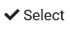</th>
<th><strong>Returned</strong> 
The has been returned by the officer to the user with an additional information request.</th>
<th>YES</th>
</tr>
<tr class="header">
<th>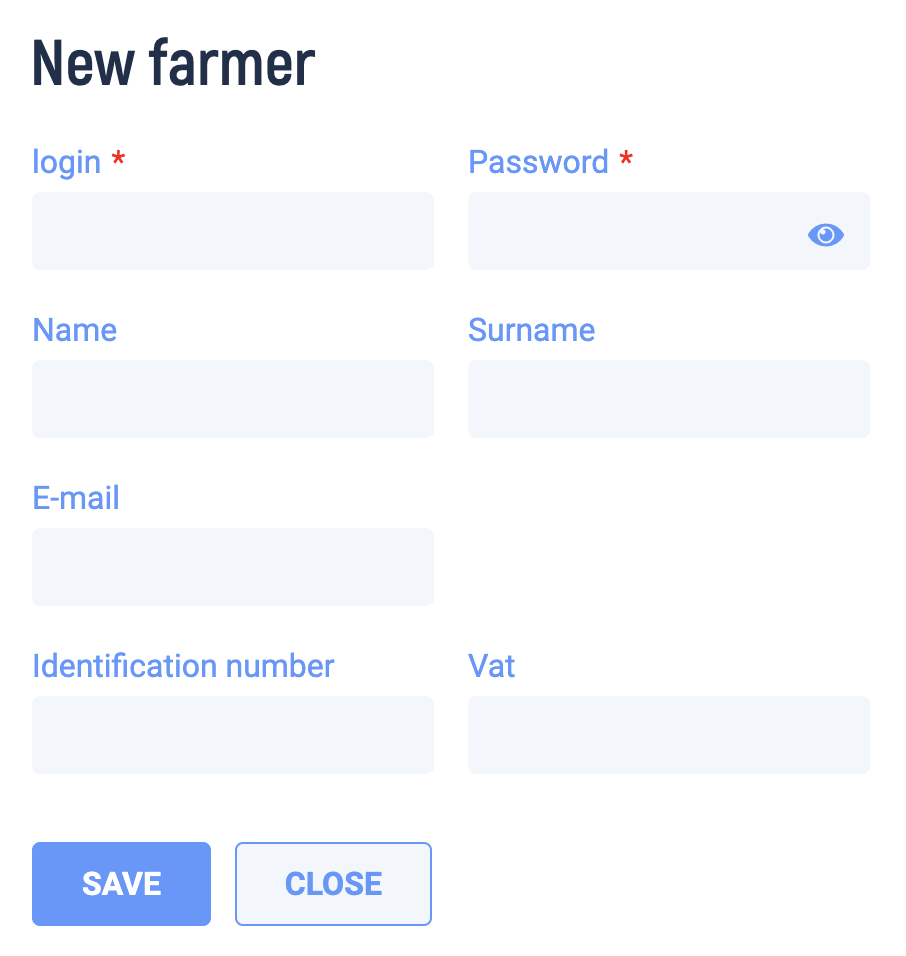</th>
<th>
<strong>Data provided</strong>

The task which was completed and sent by the user to the PA
</th>
<th>NO</th>
</tr>
<tr class="odd">
<th></th>
<th>
<strong>Data confirmed (approved task)</strong>

The completed task has been approved.
</th>
<th>NO</th>
</tr>
<tr class="header">
<th>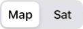</th>
<th>
<strong>Data checked (rejected)</strong>

The completed task has been rejected.
</th>
<th>NO</th>
</tr>
<tr class="odd">
<th>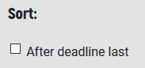</th>
<th>
Closed

The task has been closed is not active.
</th>
<th>NO</th>
</tr>
</thead>
<tbody>
</tbody>
</table>

To ensure that all tasks are current, the user must manually start the
synchronization process (M).

### Task detail

The task detail (Fig. 6) shows the data attributes of the task,
including all captured images. Depending on the status of the task, the
task can either be edited or viewed.

-   The upper section lists the basic data attributes of the task.

-   The *Instructions* section shows the description needed to complete
    > the task given by an authorized staff member of the Paying Agency.

-   The Reason for return section describes the reason for the Paying
    > Agency why the task was returned for a new performance.

-   The *Note* section is completed by the user as part of completing
    > the task before it is submitted.

-   The photo section shows thumbnails of photos taken. The user takes
    > photos by clicking the
    > 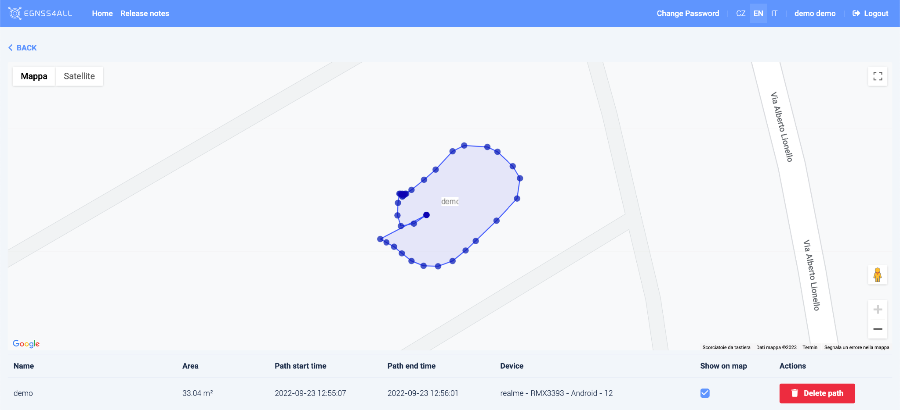
    > , which enters the camera mode for shooting (Camera Mode). Tap to
    > delete the currently displayed photo
    > 
    > .

-   The *Map* button shows all photos of the task in the map view.

-   Use the buttons *Previous* and *Next* to move between photo
    > previews.

A photo cannot be deleted if it has been already sent to the server,
even if the task is in an editable state.

Click the *SEND* button to send the message. After successful
submission, the task can no longer be edited. If an error occurs during
sending process, for example if the Internet connection was not strong
enough at the time of sending, the task will be locked. In the locked
state, the task is non-editable and the user can only retry its
successful submission, or remove this locked state by starting the
synchronization process.

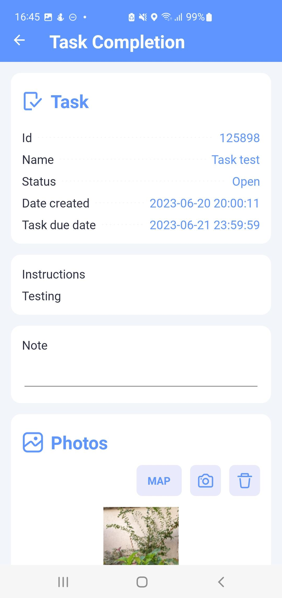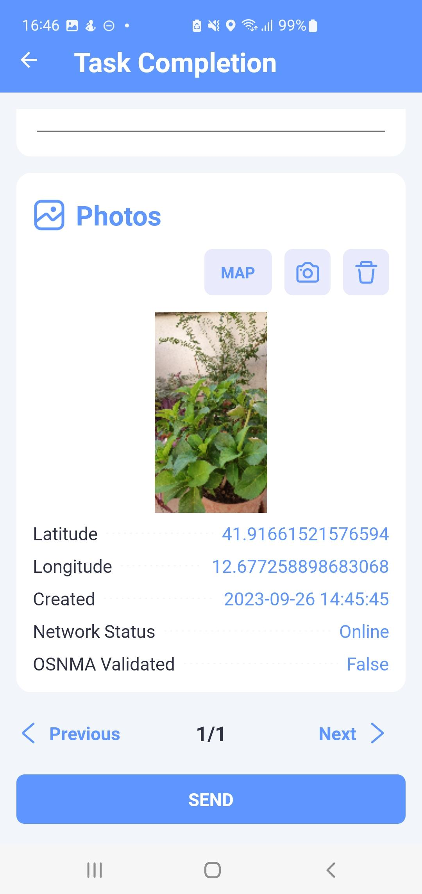

**  
**

**Fig. 7 Task edit**

Clicking on the photo preview will open a window with its detail (Fig.
7). The basic attributes of the photo are displayed in the upper left
corner. In this view, you can switch views between all photos of the
task using the buttons
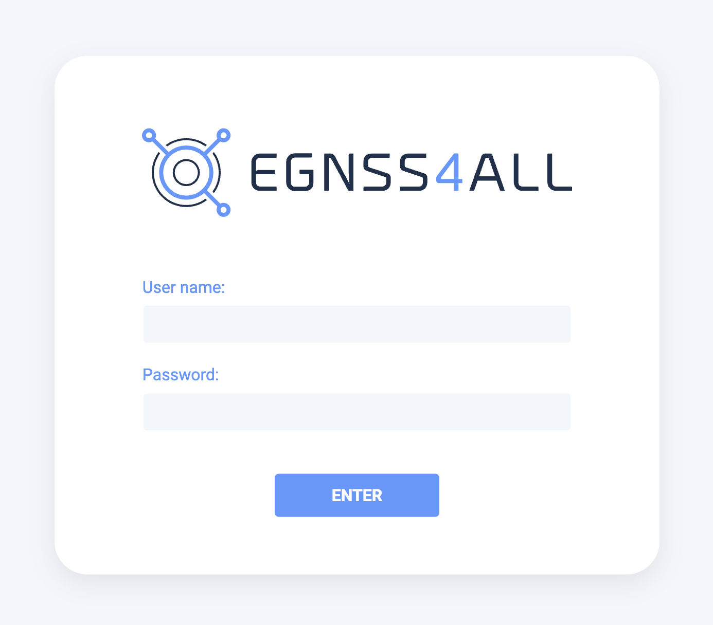
and
,
or by swiping your finger on the photo to the right or left. The screen
*Detail* supports displaying in portrait or in landscape mode. If
possible, the photo can also be deleted from this view with the

.

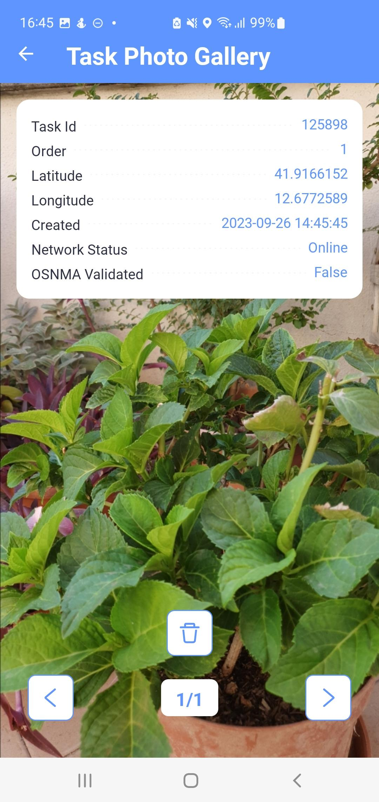

**  
**

**Fig. 8 Photo detail**

### Standalone Snapshots

Screen showing photos in the list (Fig. 8) taken separately outside the
task. In each list item, on the left is a preview of the photo and on
the right a list of basic metadata.

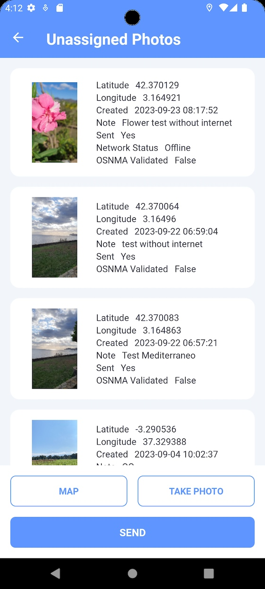

**Fig. 9 Overview of standalone photos**

From this screen, new photos are taken by touching of a button *TAKE
PHOTO*, which enters the user to take camera mode (Camera Mode). Click
the *SEND* button to send all newly taken unsent photos in the list. The
*MAP* button shows all these photos in the map view.

Clicking on a photo item in the list opens its detail (Fig. 9), where
the editing is performed using the buttons at the bottom of the screen.

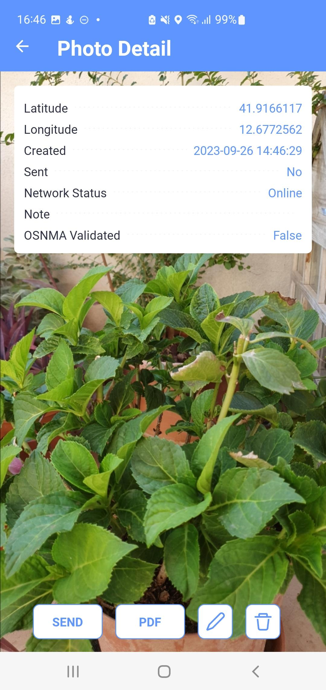

**Fig. 10 Detail of a standalone photo**

-   
    > opens a dialog for editing a note on a specific photo.

-   
    > deletes the displayed photo.

-   SEND button uploads the displayed photo to the server.

After sending, the photo becomes non-editable. If an error occurs during
uploading, the photo will be set to locked mode. The same rules apply to
this mode as for submitting a task.

### Camera Mode

A camera screen interface is used to take a single photo or a photo for
a task (Fig. 10).

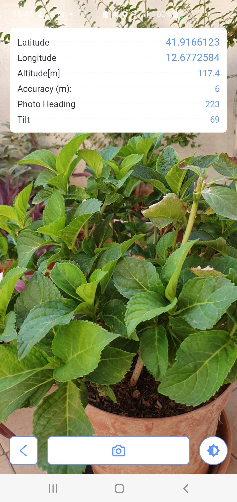

**Fig. 11 Camera mode screen**

The basic location data is displayed in the upper left corner:

-   *Latitude* indicates the latitude in degrees.

-   *Longitude* indicates longitude in degrees.

-   *Altitude* indicates the height above the reference surface of the
    > WGS 84 ellipsoid.

-   *Accuracy* is an estimate of horizontal accuracy as the radius of
    > reliability.

-   Image *azimuth* indicates the azimuth of the horizon the camera
    > captures.

-   The *angle* expresses, in degrees, the tilt of the vertical axis of
    > the screen to project on the horizontal surface of the earth.

If shooting with *position center of gravity* calculation is enabled in
the settings, a window with data on the currently calculated position
center of gravity is also displayed:

-   *Latitude* indicates the latitude of the center of gravity in
    > degrees.

-   *Longitude* indicates the longitude of the center of gravity in
    > degrees.

-   *Samples* indicates the current number of processed samples to the
    > total number specified in the application settings.

If manual brightness correction is enabled in the settings, this

is available . Click this button to display a slider to adjust the
darkening or lightening of the image, as needed. The setting of this
correction is retained even after the application is closed. Clicking in
the middle area of this bar resets the brightness lock. If the camera
does not respond to a change in brightness and the image is too dark or
too bright, the camera hardware is not compatible with this application.
In this case, it may help to turn off manual correction in the
application settings (*Settings*).

The camera supports both portrait and landscape shooting.

The photo is taken by tapping the camera

, or by pressing the hardware button on the device defined in the
application settings (*Settings*). Then the auto shutter will release
with a countdown of approximately 5 seconds. The following conditions
must be met to take a photo:

-   The device must have a sufficiently good reception of location data.

-   The user must not move and must stand still.

In addition, if center-of-gravity photography is permitted:

-   The center of gravity of the position must already be calculated or
    > a predetermined number of samples must be collected for its
    > calculation.

If any of these conditions are not met, a warning message will be
displayed, shooting will not be enabled and the shooting button will not
be available. If any of these conditions are violated during auto
shutter release, the image will also be rejected.

Click the button

to close the Camera mode and return to the previous screen.

### Map

The map is divided into two modes, one (photo mode) showing a group of
photos of the logged in user (from sets of individual photos or photos
within tasks), the other (path tracking mode) shows the currently
recorded or already recorded paths.

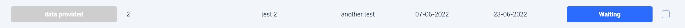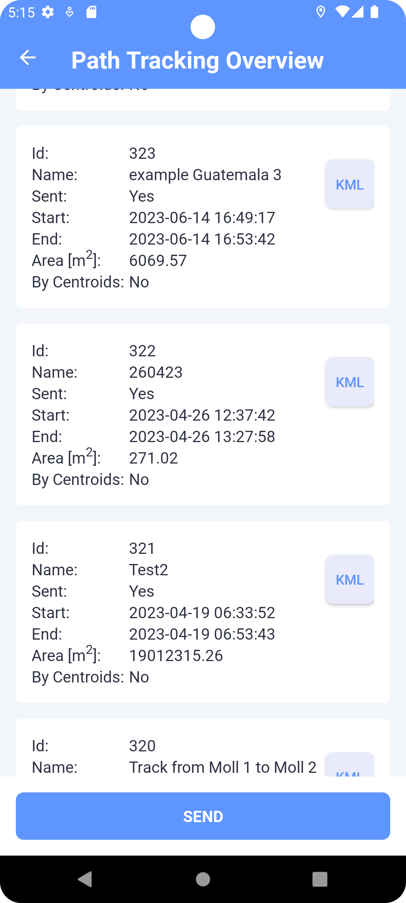

**Fig. 12 The map photos and tracked paths**

If location data is available, the current position will be marked on
the map in the form of a blue dot , which can be navigated on the map by
tapping the

.

Button

**/**
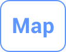
switches the map view to a satellite or a map view.

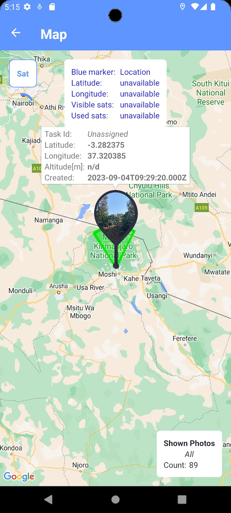

**Fig. 13 Preview of the photo on the map**

If the map is in path tracking mode, the current position calculated
from GNSS as the center of gravity of the positions is also displayed.
This location is indicated by a red dot . This position is always
updated after the collection of all samples necessary for the
calculation of the center of gravity, the number of which is defined in
the application settings (*Settings*) by the parameter *Number of
samples for the center of gravity*. Samples for calculating this
position are taken from GGA sentences from NMEA messages from navigation
satellites. Let these individual samples be denoted as
*p**i*. The calculation is performed as follows:

The centroid *c* of the set *S* ⊂ *R*2 consisting of all
defined points *p**i* ∈ *S*, *i* ∈ {1,2,…,*n*} is computed as
the average of the points

$\\frac{p\_{i}}{C\_{m}}$where *C**m* ⊂ *S* is the *innermost
convex hull* of set *S*.

The innermost convex hull is computed based on following definition:

Let the set *C*1 be a convex hull of the original set
*S*0 = *S*.

Then the recursive relation

*S*1 = *S*0{*C*1*C**i*is
convex hull of *S**i* − 1  
*S**i* = *S**i* − 1{*C**i*

can be defined (*i* ∈ *N*). Since finally many points in the set
*S*0 are defined, there exists finally one
*S**m* = ⌀ ∧ *S**i* ≠ ⌀ for ∀*i* \< *m*. Then
*C**m* is the innermost convex hull of the set *S*.

In the path tracking mode of the map, you can record a path in the map
view. Click the *RECORD* button, the dialog opens for entering a path
name, which is optional. When this dialog is confirmed, the path will be
recorded. The user can switch the application screens at will when
recording the path, but the application must remain active and in the
forefront of Android processes. The path is recorded in the form of
points, between which there is an approximate recording interval of 1
second. When recording, the path is simultaneously drawn on the map in
the form of a black linearly angled curve. Each point on the curve is
represented by a pin

. When you click on it, an overview of its geolocation data is
displayed. Use the PAUSE / UNPAUSE button to pause a path recording.
Click the STOP button and then confirm the dialog box to end the
recording. The path is then drawn as a polygon, where the first and last
points of the path are connected. You can send the path to the server by
clicking on SEND button. Click the *PATHS* button to go to the list of
already recorded paths (*Paths*), where you can select a path to draw it
on the map. Fields *id* and *name* of the drawn path on the map
(currently recorded or already recorded) are displayed in the overview
next to the buttons for recording the route. Clicking in this report
will move the map view to this path. In the application settings, you
can turn on a sound tone when recording a path point and automatically
pan the map view to the current location during recording.

### Paths

This list shows all recorded routes (Fig. 14). Clicking on a specific
road will draw it on the map (M). Each path already sent to the server
is assigned its ID (*identification number*). If the route has not yet
been sent, it can be deleted by clicking on the

. Click on the SEND button to send all paths which has not been sent
yet.

-   The Area attribute is an approximation of the area of a polygon
    > formed by a path in square meters.

-   The *By the center* of gravity attribute determines whether
    > waypoints were taken as the center of gravity of the positions.

-   

> 

**Fig. 14 Recorded paths list**

### GNSS Raw Data

In this screen (Fig. 14) the user sees the current raw GNSS data
received from the satellites with a basic overview of the device, the
same as on the main screen (M). Most of the data is obtained from NMEA
message records.

-   Used satellites

    -   Number of satellites used

-   Satellites visible

    -   Number of visible satellites sending the SNR.

-   EGNOS

    -   Marked positive if the GPS Quality indicator value of the GGA
        > sentence is equal to 2, marked negative if it is equal to 1,
        > and marked as undecided in other cases.

-   Geolocation information

    -   The *Latitude, Elevation, Altitude, N / S,* and *E / W*
        > attributes are taken from the GSA sentences.

    -   The attributes *HDOP, PDOP, VDOP*, and *Quality Assessment* are
        > taken from the GSA sentence.

    -   The *Accuracy* attribute is an estimate of horizontal accuracy
        > as the radius of 68% reliability. It is obtained from the
        > location service.

    -   The *Accuracy* in meters attribute is calculated above the
        > center of gravity of the position. The calculation parameters
        > are defined by the application settings.

-   VTG info

    -   All attributes are read from the VTG sentence.

-   RMC Info

    -   All attributes are read from the RMC sentence.

-   SNR

    -   Mean *SNR* of the last detected satellites.

-   List of satellites

    -   *GALILEO SATs, GPS SATs, GLONASS SATs, BEIDOU SATs* display
        > satellites sending the SNR.

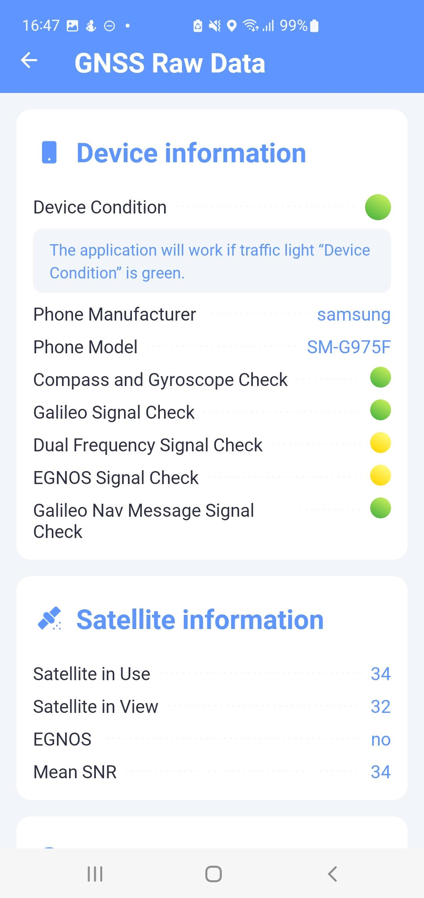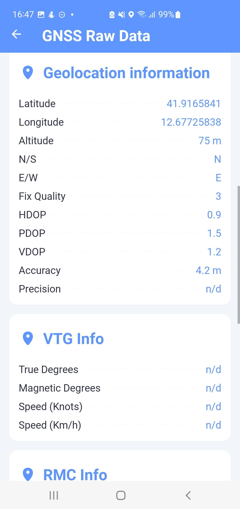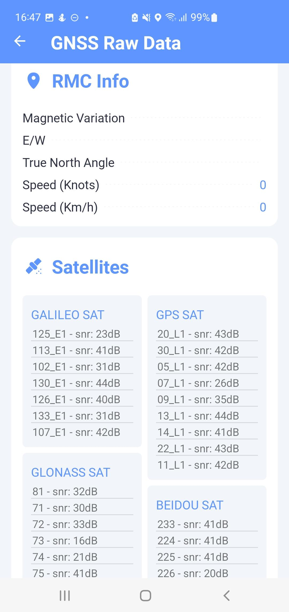

**  
**

**  
**

**Fig. 15 GNSS Raw Data**

### GNSS SkyMap

This section let you compare the expected sky map of satellites
calculated from your position to your actual measured sky map from the
phone.

A constellation drop-down menu let you choose a constellation to compare
and the graph updates accordingly

The points in red represent the calculated satellites position, the blue
points the actual measured positions. Positions may overlap and result
in a purple point representing the two values are one and the same and
therefore correct.

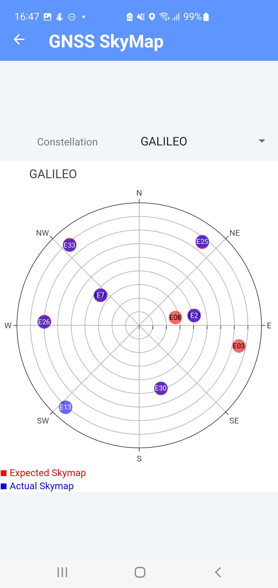

**Fig. 16 GNSS SkyMap**

## About

This screen contains basic information about the application (Fig. 16).

**  
**

**Fig. 17 About screen**

## Settings

The screen provides the main settings of the entire application (Fig.
17).

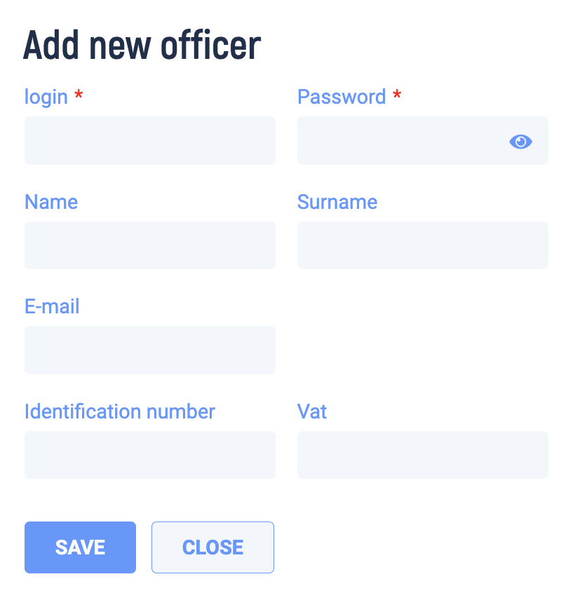

**Fig. 18 Settings Screen**

-   GNSS Location Settings

    -   Customization of the location algorithm and constellation,
        > assisted correction and centroid calculation (Fig.18)

-   External Bluetooth GPS

    -   Use an external bluetooth GPS device as location source.
        > (Fig. 19)

-   Tracking centroid samples

    -   Sets the number of samples required to calculate the position
        > centroid.

    -   Click the Default button to set the default number.

-   Button to take a photo

    -   Defines a hardware button for taking a photo in camera mode (C).

    -   If activated, the dialog for setting the hardware button on the
        > device is displayed. The setting is made by pressing the
        > desired button when this dialog is displayed.

    -   Not all buttons on the device are suitable or usable. E.g.
        > suitable buttons are for volume control. E.g. the screen lock
        > button cannot be used.

-   Manual brightness correction

    -   Activates the manual brightness correction option in camera mode
        > (C).

-   Automatically pan the map during a path recording

    -   Automatically focus the map view to your current location while
        > recording a path (M).

-   Beep when recording a path point

    -   Emits a tone each time a point is recorded while recording a
        > path (M).

External Bluetooth GPS

This section allows to scan for an external GPS Device and pair it to
your application to use it as the source of the location.

The button SCAN DEVICES allow you to start scanning for devices, a list
of devices detected will appear. After choosing a device, you can press
TEST CONNECTION to test if the device is connected AND compatible with
the application.This setting is saved and the device data will be used
for all location instances in the application (map, tracking and photo).

> **Fig. 19 External Bluetooth GPS**

## Offline Usage 

The user can snap pictures even when there is no internet connection
available, and then send the pictures when it is. Pictures will be
stored in a protected storage space of the app for later usage.

In case of OSNMA validated picture, the verification process of the
picture will happen when the user sends their pictures to the server,
based on the data gathered during the shot.

2.  # Mobile Application - iOS

    1.  ## Installation 

        1.  ### Installation from App Store or via TestFlight

The application is currently available only via TestFlight. Registration
as a tester is needed.

### Compiling from source code

The source code and the directory structure are compatible and meet the
requirements for the xcode in which it was created.

### Minimum requirements

-   iOS 13 compatible iPhone or iPad or newer (iPhone 6S/SE or newer)

    1.  ## Application Start and Permissions

The application can be run by selecting it in the list of applications.

-   Make sure to grant permissions to access the device’s location and
    > take pictures:

<!-- -->

-   Access device’s location

<!-- -->

-   Allow to add location data to token photos

-   Receiving different types of location data

-   Recording paths

<!-- -->

-   Take pictures and record video

<!-- -->

-   Allow to take photos by camera.

To log in to the application, connection to the internet is required.
After the first login, the user will be remembered. A new login will
only be required after explicit logout.

### Login

After the first launch of the application and granting all the necessary
permissions to the application, the user will be presented with a login
screen (Fig. 19), where the assigned login and password will need to be
filled out. Click the *Sign In* button to complete the login.

To successfully log in, all data most be entered correctly and the
device should be connected to the Internet at the time of login. The
login details will be remembered for future uses of the app. Re-login
will be required only after explicit logout of the user.

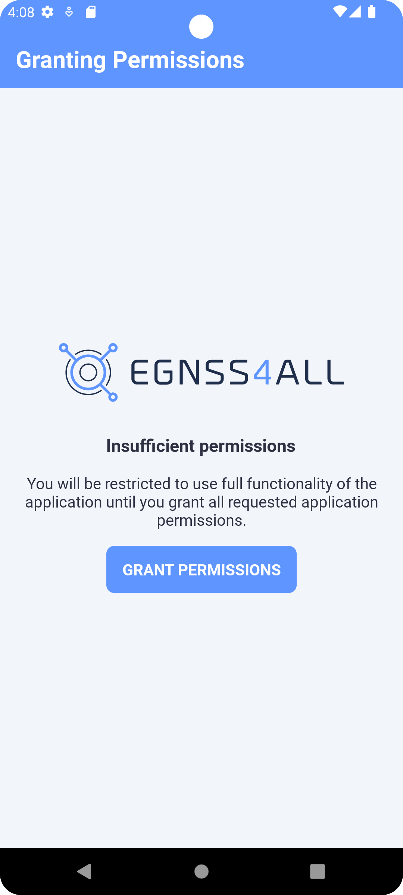

**Fig. 20 Login screen**

Through the "Select Server" button, it will be possible to set the URL
of a custom server that will be used instead of the app's default
server. Once you have logged in, in order to return to the default
server, you will need to perform a logout and deselect the custom
server.

**Fig. 21 Select Server**

## Main Screen

The attributes of the host device are displayed in the “Basic Info”
section. Traffic lights are displayed next to some of the attributes.
Their detailed description is given below.

-   Location service check

    -   The green color indicates the active ability of the phone to
        > determine its current location.

    -   Red means an inability to determine your current position. If
        > this is the case, location services on the device may be
        > disabled.

Other attributes use the green or yellow color.

Green indicates that the device has that particular property. Yellow
indicates that the device does not have the given property or has not
yet been able to verify the given availability and may change to green
over time.

-   Galileo capability

    -   Checks if the device is capable to read Galileo signals

**Fig. 22 Main screen**

The application modules can be accessed through by pressing buttons
which are situated in the bottom of the screen. The following options
are available:

-   Photos

    -   Open screen with list of unowned photos.

-   Tasks

    -   Open screen with task list.

-   Map

    -   Open screen with map including all captured photos, recording
        > new paths or viewing already recorded paths.

-   Settings

    -   Open screen with settings.

-   About

    -   Open screen with basic information about application

        1.  ### Task List

In the task overview (Fig. 21), user tasks are listed by name, status,
number of captured images, creation date and due date. By clicking on a
specific task, a screen with details and options to edit is displayed.

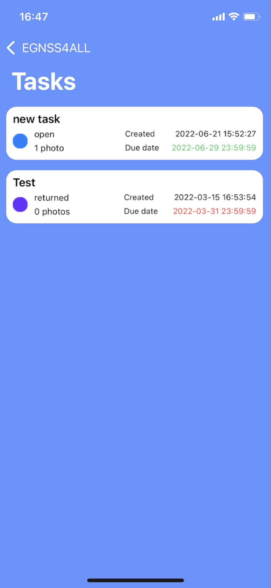

**Fig. 23 Task list**

Tasks can be set in following states, which also determine their
editability:

<table>
<colgroup>
<col style="width: 4%" />
<col style="width: 78%" />
<col style="width: 17%" />
</colgroup>
<thead>
<tr class="header">
<th colspan="2"><strong>Description</strong></th>
<th><strong>Editable</strong></th>
</tr>
<tr class="odd">
<th></th>
<th>New 
A new task</th>
<th>YES</th>
</tr>
<tr class="header">
<th></th>
<th>
Open

A new task, which has been already displayed by the user. The user is aware of the task.
</th>
<th>YES</th>
</tr>
<tr class="odd">
<th></th>
<th>Returned 
The has been returned by the officer to the user with an additional information request.</th>
<th>YES</th>
</tr>
<tr class="header">
<th></th>
<th>
Data provided

The task which was completed and sent by the user to the PA
</th>
<th>NO</th>
</tr>
</thead>
<tbody>
</tbody>
</table>

### Task detail

The task detail (Fig. 22) shows the data attributes of the task,
including all captured images. Depending on the status of the task, the
task can either be edited or viewed.

-   The upper section lists the basic data attributes of the task.

-   The *Instructions* section shows the description needed to complete
    > the task given by an authorized staff member of the Paying Agency.

-   The *Reason for return* section describes the reason for the Paying
    > Agency why the task was returned for a new performance.

-   The *Note* section is completed by the user as part of completing
    > the task before it is submitted.

-   The photo section shows thumbnails of photos taken. The user takes
    > photos by clicking the
    > 
    > , which enters the camera mode for shooting (Camera Mode). Tap to
    > delete the currently displayed
    > 
    > .

-   Use the buttons *Previous* and *Next* to move between photo
    > previews.

A photo cannot be deleted if it has been already sent to the server,
even if the task is in an editable state.

Click the *SEND* button to send the message. After successful
submission, the task can no longer be edited.

**Fig. 24 Task edit**

Clicking on the photo preview will open a window with its detail (Fig.
23). The basic attributes of the photo are displayed in the upper left
corner. In this view, you can switch views between all photos of the
task using the buttons

and

.

**Fig. 25 Photo detail**

### Standalone Snapshots

Screen showing photos in the list (Fig. 24) taken separately outside the
task. In each list item, on the left is a preview of the photo and on
the right a list of basic metadata.

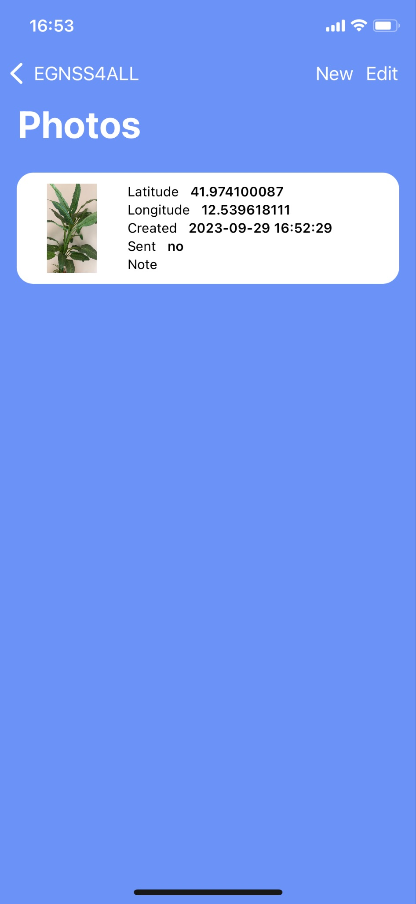

**Fig. 26 Overview of standalone photos**

From this screen, new photos are taken by touching of a button *NEW*,
which enters the user to take camera mode (Camera Mode).

Clicking on a photo item in the list opens its detail (Fig. 25). Click
the *SEND* button to send the photo to server.

**Fig. 27 Detail of a standalone photo**

It’s possible to export a PDF file with the relevant data of the picture
with the “PDF” button on the bottom.

### Camera Mode

A camera screen interface is used to take a single photo or a photo for
a task (Fig. 26).

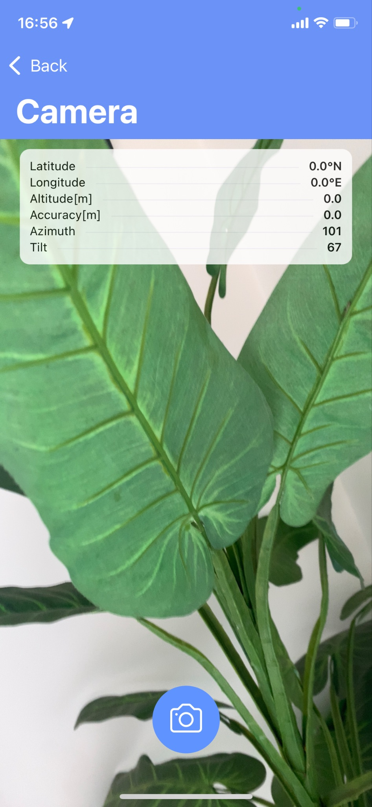

**Fig. 28 Camera mode screen**

The basic location data is displayed in the upper left corner:

-   *Latitude* indicates the latitude in degrees.

-   *Longitude* indicates longitude in degrees.

-   *Altitude* indicates the height above the reference surface of the
    > WGS 84 ellipsoid.

-   *Accuracy* is an estimate of horizontal accuracy as the radius of
    > reliability.

-   Image *azimuth* indicates the azimuth of the horizon the camera
    > captures.

-   The *angle* expresses, in degrees, the tilt of the vertical axis of
    > the screen to project on the horizontal surface of the earth.

If shooting with *position center of gravity* calculation is enabled in
the settings, a window with data on the currently calculated position
center of gravity is also displayed:

-   *Latitude* indicates the latitude of the center of gravity in
    > degrees.

-   *Longitude* indicates the longitude of the center of gravity in
    > degrees.

-   *Samples* indicates the current number of processed samples to the
    > total number specified in the application settings.

The camera supports both portrait and landscape shooting.

The photo is taken by tapping the camera

. Then the auto shutter will release with a countdown of approximately 5
seconds. The following conditions must be met to take a photo:

-   The device must have a sufficiently good reception of location data.

-   The user must not move and must stand still.

In addition, if center-of-gravity photography is permitted:

-   The center of gravity of the position must already be calculated or
    > a predetermined number of samples must be collected for its
    > calculation.

If any of these conditions are not met, a warning message will be
displayed, shooting will not be enabled and the shooting button will not
be available. If any of these conditions are violated during auto
shutter release, the image will also be rejected.

Click the button

to close the Camera mode and return to the previous screen.

## Map

The map is showing a group of photos of the logged in user (from sets of
individual photos or photos within tasks and the currently recorded or
already recorded paths

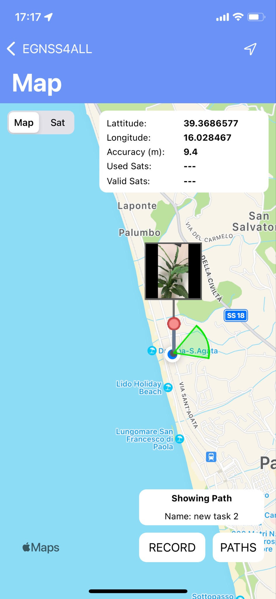

**Fig. 29 The map photos and tracked paths**

If location data is available, the current position will be marked on
the map in the form of a blue dot . Button
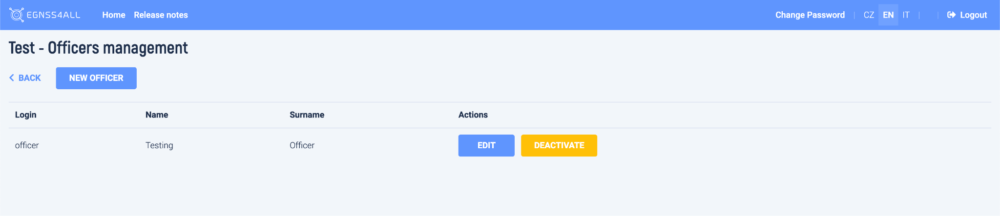
switches the map view to a satellite or a map view.

There is a black dot in the photo mode of the map at the location where
the image was taken, with a small icon above it. The green circle
determines the azimuth direction of the mobile device's screen at the
time the photo was taken. Press the image icon to display an overview of
the basic attributes of the image. You can record a path in the map
view. Click the *RECORD* button, the dialog opens for entering a path
name, which is optional. When this dialog is confirmed, the path will be
recorded. The user can switch the application screens at will when
recording the path, but the application must remain active. The path is
recorded in the form of points, between which there is an approximate
recording interval of 1 second. When recording, the path is
simultaneously drawn on the map in the form of a black linearly angled
curve. Each point on the curve is represented by a pin

. When you click on it, an overview of its geolocation data is
displayed. Click the STOP button to end the recording. The path is then
drawn as a polygon, where the first and last points of the path are
connected. Click the *PATHS* button to go to the list of already
recorded paths (*Paths*), where you can select a path to draw it on the
map. Fields *id* and *name* of the drawn path on the map (currently
recorded or already recorded) are displayed in the overview next to the
buttons for recording the route. Clicking in this report will move the
map view to this path. In the application settings, you can turn on a
sound tone when recording a path point and automatically pan the map
view to the current location during recording.

### Paths

This list shows all recorded routes (Fig. 28). Clicking on a specific
road will draw it on the map (M). Click on the SEND button to send all
paths which has not been sent yet.

-   The *Area* attribute is an approximation of the area of a polygon
    > formed by a path in square meters.

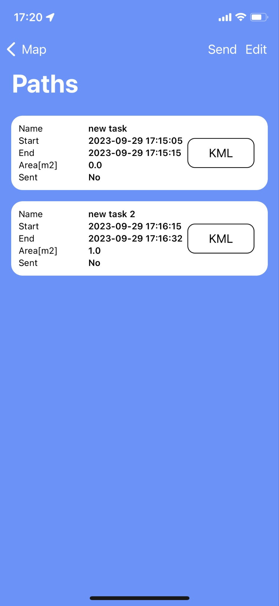

**Fig. 30 Recorded paths list**

Every path can be exported to a KML file on the phone with the
respective “KML” button.

### GNSS SkyMap

This section let you view the expected sky map of satellites.

A constellation drop-down menu let you choose a constellation to view
and the graph updates accordingly.

The points in blue represent the calculated satellites position.

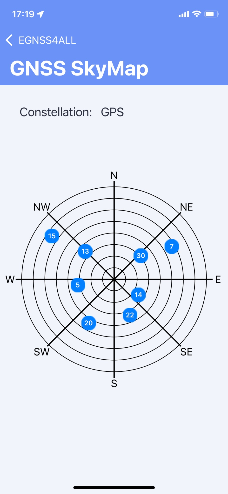

**Fig. 31 GNSS SkyMap**

## About

This screen contains basic information about the application (Fig. 30).

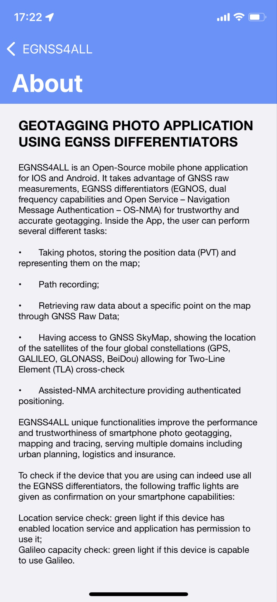

**Fig. 32 About screen**

## Settings

The screen provides the main settings of the entire application (Fig.
31).

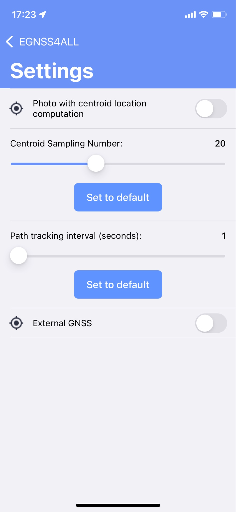

**Fig. 33 Settings Screen**

-   Photo with centroid location computation

    -   When capturing an image, location center of gravity information
        > will be added to its metadata.

-   Centroid Sampling Number

    -   Sets the number of samples required to calculate the position
        > center of gravity.

    -   Click the Default button to set the default number.

Clicking the *SET DEFAULT VALUES* button returns all filter values to
the default.

## Offline Usage

Once you have logged in, it is possible to operate in offline mode. Some
services, such as Skyview and maps, will not be available, but you will
still be able to record paths or take geolocated photos, and the data
can be sent once the device is back online.

# Web Console Interface

The web console is accessible through the following link:
[<u>https://www.egnss4all.com/</u>](https://www.egnss4all.com/)

1.  ## User roles

    1.  User role

-   Have access to his tasks and photos, but is not able to do any
    > operations.

    1.  Officer role

-   Have access to all users that belong under his agency, can move
    > tasks between states.

    1.  Super-admin role

-   Have access to Agency management module. Can create new agencies and
    > manage existing ones.

-   Does not have access to standard application.

To log in to the web interface, enter your login details.

**Fig. 34 Web Console log**

## Change Password

After logging in to the platform, every user can change his password to
a more fitting one using the button in the top right area of the
console.

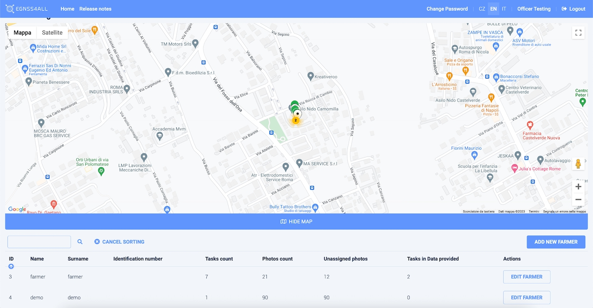

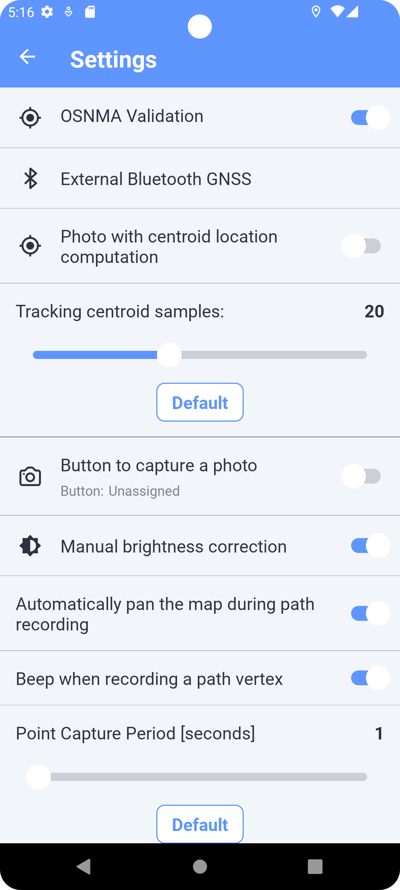

To change the current logged user password, fill in a new password and
the confirmation in the change password form. A message will warn you of
your action and if confirmed your password will change to the new one.

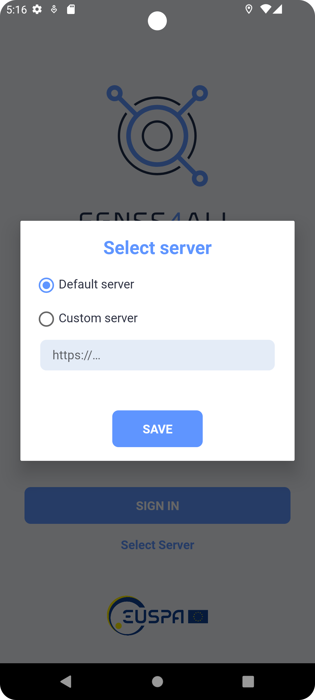

**Fig. 35 Web Change Password**

## User access

The default page after login is the Task list.

### Task List

The bottom part shows the assigned tasks, which can be sorted, filtered
and searched. In the top part, points representing individual tasks are
displayed on the map. Map is shown by default.

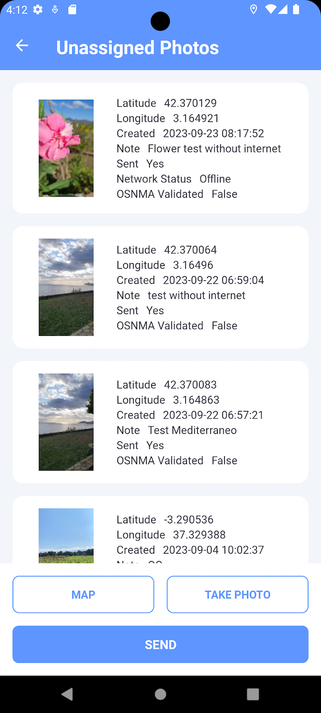

**Fig. 36 Tasks and Map**

The following options are available for the user:

6.  Open task detail (by clicking on the selected row in the list)

> 
>
> 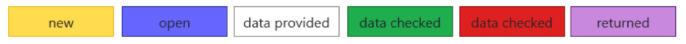

7.  Search for tasks by the specific text

8.  Filter tasks by status (by clicking on the selected status)

> 

9.  Sort tasks in a list by the selected column (by clicking on the
    > column heading) or according to the date of completion of the task
    > (with the button "Passed to the end")

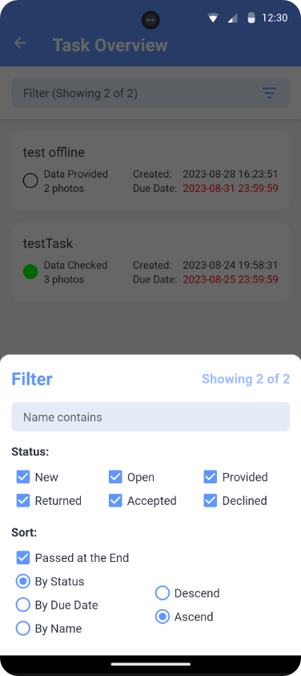

> 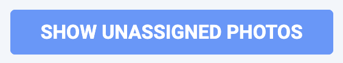

10. Display a page with unassigned photos

> 

11. Display a page with paths

12. Browse the map and open the task detail by clicking on a point on
    > the map

**Fig. 7 Tasks Status**

### Task Detail page

This page contains detailed information about the task, as well as
photos that were taken for the task. The map shows the position of the
photos, the viewing radius of the camera and the direction of the photo.
The map can be viewed.

**Fig. 38 Task detail**

Photos can be rotated here using the buttons:

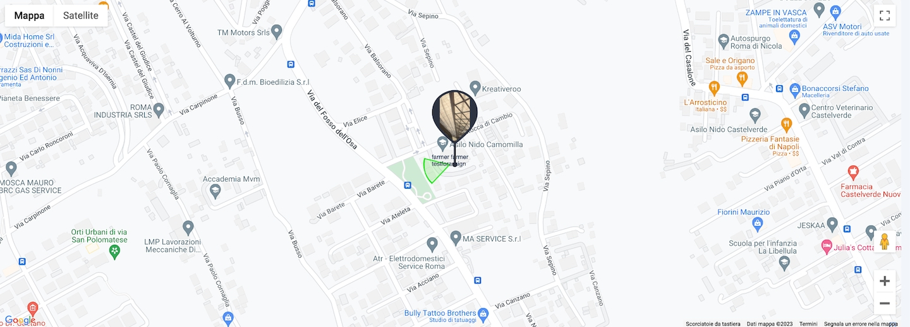

Click on the photo to open the Photo Gallery (see below).

A table with source data is placed next to each photo.

User can select photos for export to PDF.
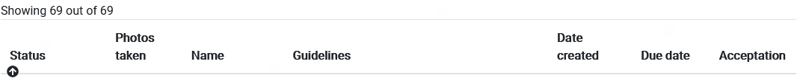

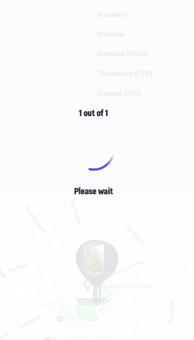

PDF export functionality is described below.

### Standalone photos gallery

At the top of the page, a map is displayed, where the position of
individual unassigned photos is marked.

**Fig. 39 Standalone task unassigned photos**

Below are photos that are not assigned to any task. A table with source
data is placed next to each photo.

**Fig. 40 Unassigned photos**

Several options are available to edit the photos:

-   Rotation
    > 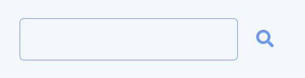

-   Delete
    > 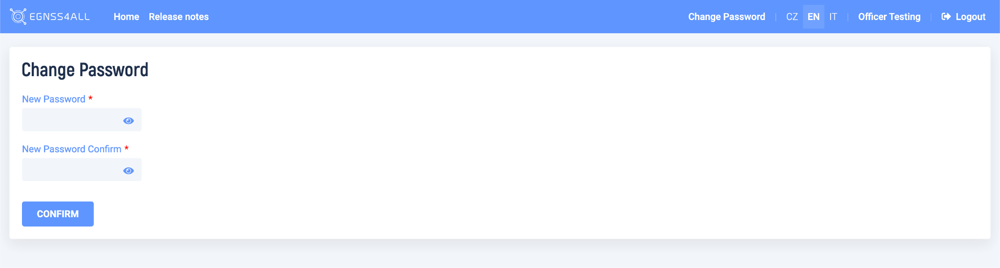

-   Select for an action
    > 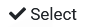

    -   By clicking the Select button, the photo is marked for the bulk
        > assignment to a task, to a bulk delete or bulk export to PDF

> 

-   Selected photos are marked by the red rectangle.

<!-- -->

-   Open photo gallery – click on the photo (see below)

When selecting bulk actions, the following options are available:

1.  Select all

    1.  Selects all unassigned photos

2.  Cancel selection

    1.  Cancels current selection

3.  Choose task

    1.  Displays a page where you can select the task to which the
        > selected photos are to be assigned. For recapitulation, the
        > photos that were marked on the previous page are displayed
        > here. Below the photos, a selection box is available, where it
        > is necessary to select the target task. The map is displayed
        > at the top of the page.

    2.  After clicking the Confirm button, a dialog box will appear,
        > where by pressing the OK button, the process of assigning
        > photos will be completed.

    3.  Once finished, the user is navigated back to the Task list
        > screen.

4.  Delete selected photos

    1.  Displays a dialog box where, after confirmation by pressing OK,
        > the marked photos will be
        > deleted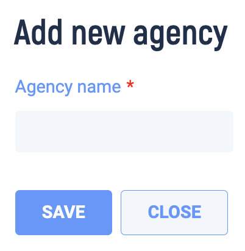

5.  Export all to PDF

    1.  This button pass all photos to PDF export

6.  Export selected to PDF

    1.  This button pass selected photos to PDF export

PDF export functionality is described below.

### Photo gallery

The gallery is accessible from various places in the application, always
by clicking on the photo.

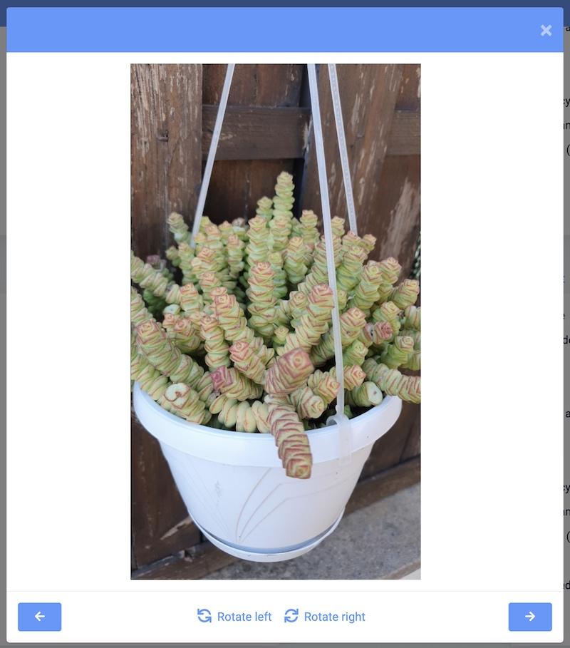

**Fig. 41 Photo gallery  
**

At the bottom is the control panel, where you can rotate the photo and
jump between photos using the arrows.

Clicking on a photo in the gallery opens a new window in which the photo
is loaded in its maximum size and it is possible to zoom in (Zoom in) or
zoom out (Zoom out), or set the default size (Reset zoom). Zoom change
is for preview only, and will not be saved.

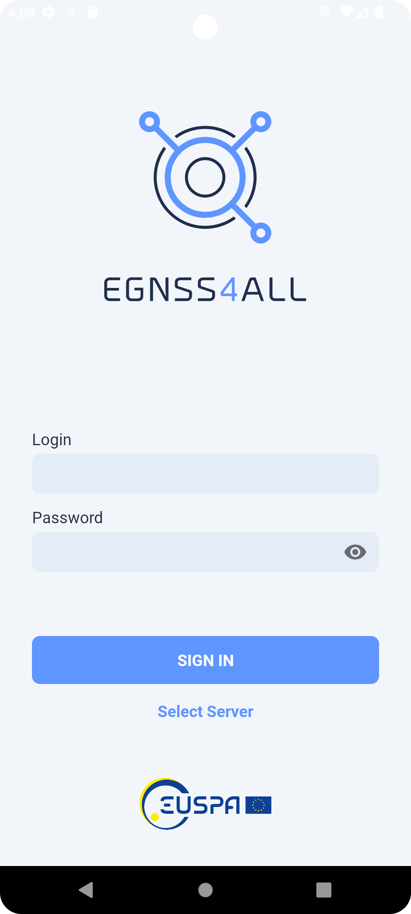

### 

### User paths

At the top of the page, a map is displayed, where all of the paths are
shown.

**  
Fig. 42 User paths**

Paths can be highlighted by clicking on the map. Each path has displayed
points of which it is composed. Click on the point to display a table
with detailed information.

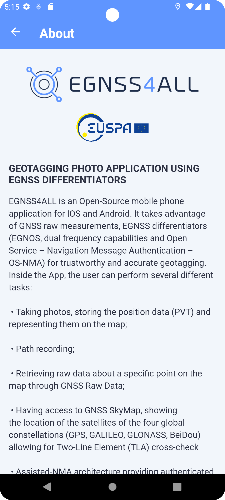

**Fig. 43 Highlighted path with point detail**

Below is a list of paths of the selected user. Only selected routes can
be displayed on the map using the checkbox in the Show on map column.

Paths can be deleted using delete path.

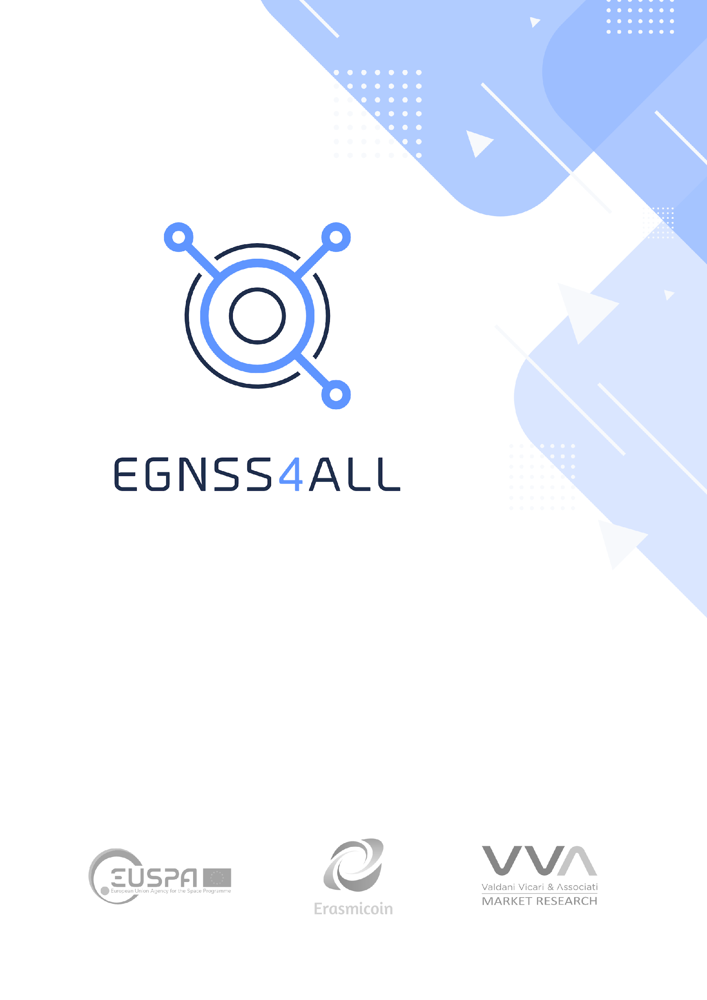

### Generating PDF documents

The functionality of exporting data to PDF is triggered by buttons:

The buttons are available at the Unassigned photos page and the Task
detail page.

The button “Export all to PDF” passes all photos at current page to a
PDF export and open a PDF prepare page.

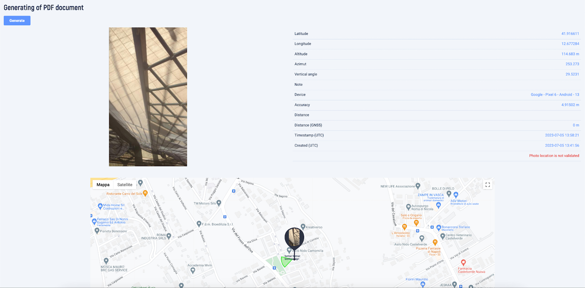**  
  
Fig. 44 PDF generating prepare page**

On the PDF prepare page are displayed all the photos which are going to
be exported. Every photo has its own map generated especially for the
PDF which can be adjusted before export. Once everything is prepared
(progress loader disappears), export is executed by clicking the
“Generate” button.

Generating PDF can take some time, which depends on total count of
exported photos. The user is informed by progress loader.

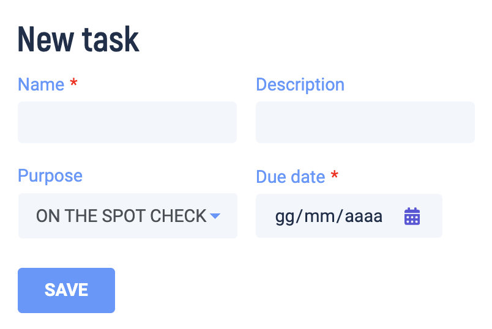

**Fig. 45 Progress loader**

The button “Export selected to PDF” passes to the PDF export just the
selected photos:

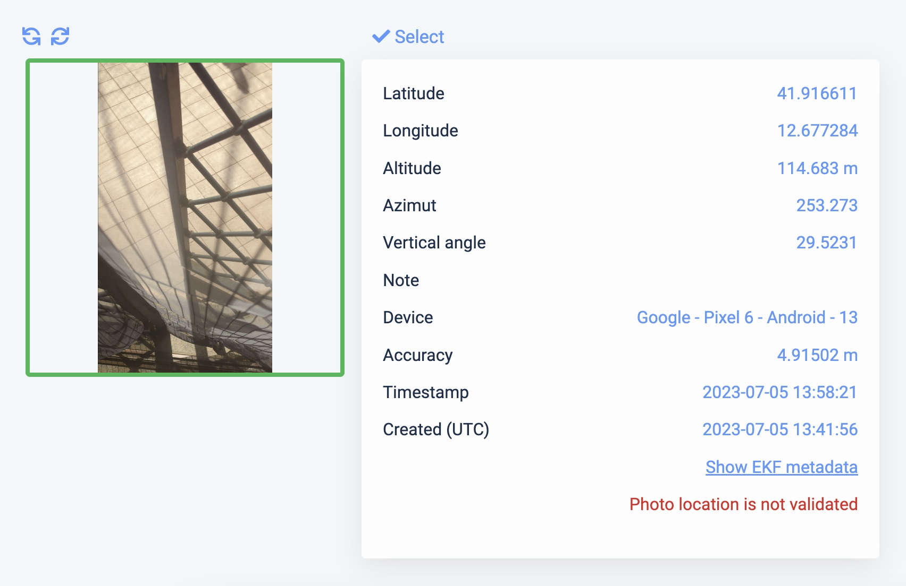

**Fig. 46 Selected photo**

Next steps of the exporting process are identical to process steps
described above (“Export all to PDF”).

### Map

**Fig. 47 Map**

Points that represent photos or tasks displayed on the currently open
page are always displayed on the map.

The zoom of the map is automatically set so that all points are visible
in the displayed area of the map. The zoom can be adjusted manually
(with the mouse wheel or using the control panel on the map).

The points are color-coded according to the active status of the task.
The color of the points corresponds to the color of the status in the
task list. Points representing unassigned photos are not color-coded.

**Fig. 44 Task status list**

Click on a map point to open the task detail.

**Fig. 48 Map - a middle zoom**

Due to the possible high concentration of points in a small area, the
points are grouped into one group with a numerical expression of the
number of points in a given place. Click on the group icon to zoom in on
the group position. As you zoom in greatly on the map, points are
changed to preview banners that display a specific user, the name of the
task, the photo and the radius of the camera view at the time the photo
was taken. Clicking on this banner opens the following task detail.

Polygons of existing plots and their names are also shown.

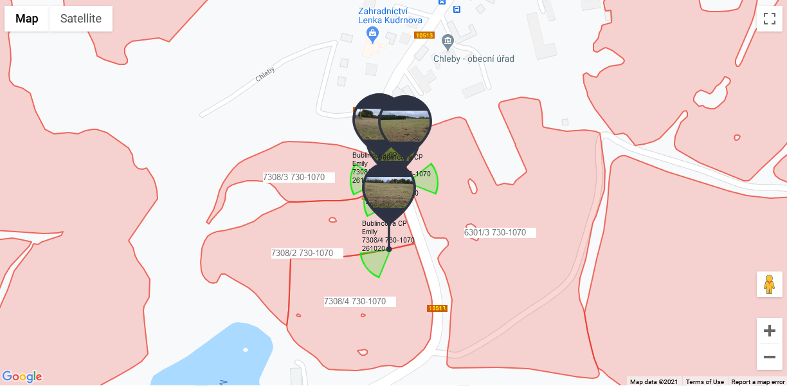

**Fig. 49 Map – detail zoom in**

## Administrator

After logging in, the user management page is displayed. Graphically and
functionally, the application is the same as in the approach for users.
In the administrator access, controls are added as described below.

### User management

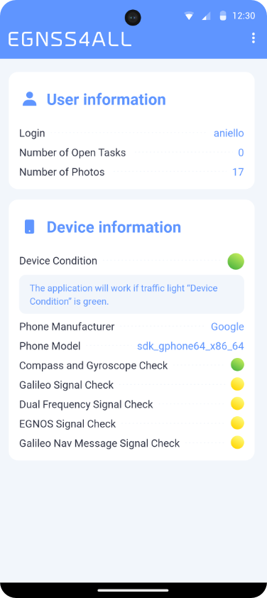

**Fig. 50 User management**

At the top is a map with all the tasks of all users. At the bottom is a
list of users.

The following options can be used:

-   Search for a user according to the entered text

> 

-   Sort users in the list by the selected column (by clicking on the
    > column heading)

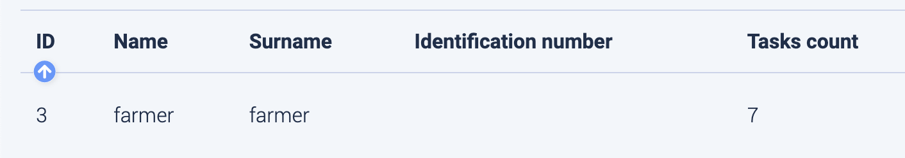

-   Open user detail

> 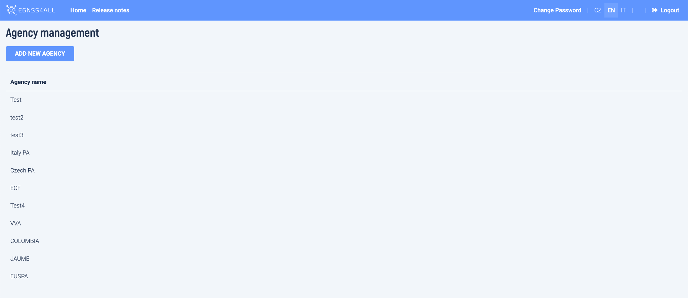
>
> 

-   Add a new user

    -   By clicking on the button, a table is displayed in which it is
        > necessary to fill in the data of the new user. The creation of
        > a new user is confirmed by pressing the Save button.

    -   The entered login and password will be used by the user to
        > access the application.

> 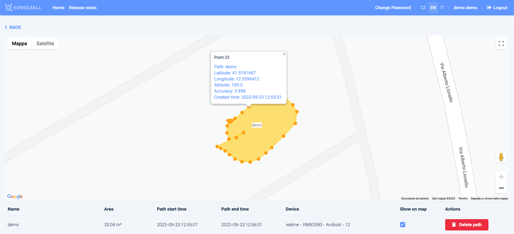

-   Edit an existing user

> 

-   Clicking the button displays the same table as when creating a new
    > user. In this case, the table is pre-populated with the data of
    > the selected user. The data can be edited in the table (except for
    > the login) and their modification can be confirmed with the *Save*
    > button.

-   If the password field is left blank, the password remains the same.

    1.  ### User Detail

**Fig. 51 Tasks - Administrator**

This page is the same as in the user's approach, extended by the
following:

-   New task

> 

-   Clicking on the button displays a table in which it is necessary to
    > fill in the data of the new task. The creation of a new task is
    > confirmed by pressing the Save button. A new task is created with
    > the status "*new*".

> 

-   Bulk task approval function

    -   To perform a bulk approval, you must first mark the tasks to be
        > approved. By checking the box for the required tasks in the
        > right column of the table.

    -   Only tasks with the status *"data provided"* can be approved.

    -   After pressing the Approve in bulk button, a dialog box is
        > displayed, where after pressing the OK button, the bulk action
        > will be performed.

    -   Approval of tasks changes their status to *"data checked"* and
        > the acceptance status to *"Approved".*

-   Photos

    -   The *Examined* column graphically shows whether the photo checks
        > were OK or not.

    -   This involves checking the correctness of the position and
        > checking the originality of the photo.

    -   Complete control information is displayed in the task detail for
        > each photo.

        1.  ### Task Detail

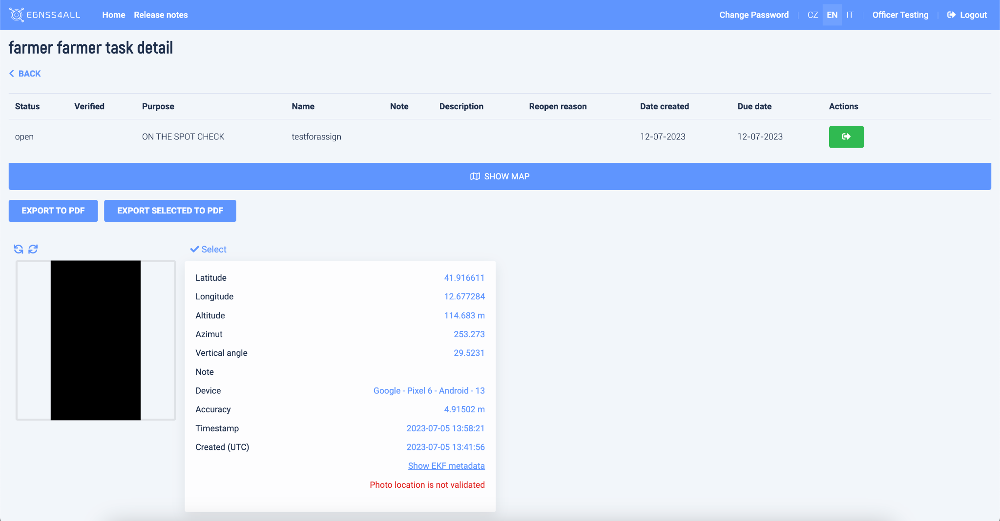

**Fig. 51 Task detail – Administrator view**

This page is the same as in the user's approach, extended by the
following:

-   Actions

    -   Approve
        > 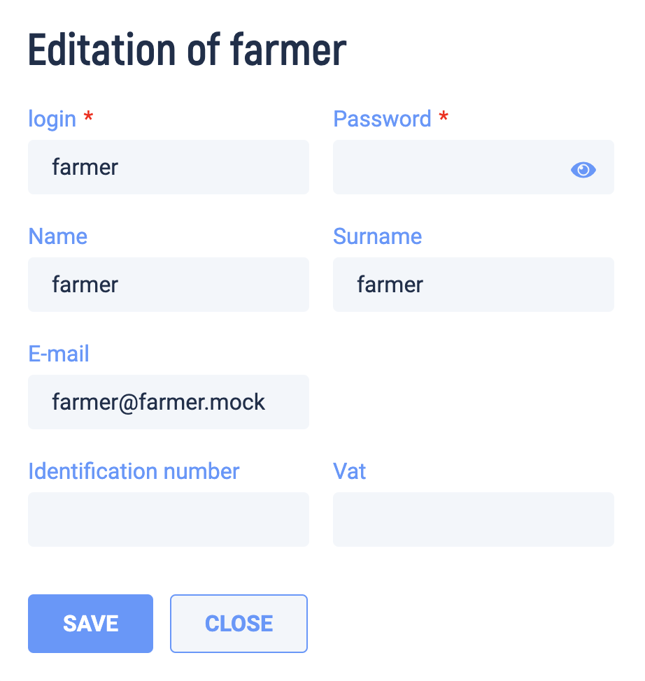

        -   This action is available with the status *"data provided",*
            > and allows you to approve a task.

        -   After pressing the *Approve* button, a dialog box is
            > displayed, where after pressing OK the action is done

        -   The result of the action is the setting of the status *"data
            > checked"* and the reception status *"Approved".*

    -   Reject
        > 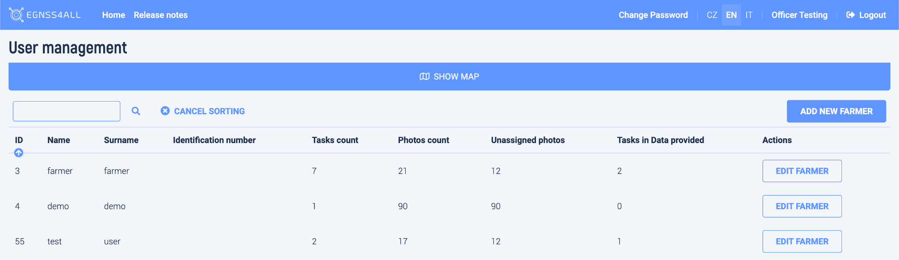

        -   This action is available with the status *"data provided",*
            > and results in the rejection of a task.

        -   After pressing the *Reject* button, a dialog box is
            > displayed, where it is possible to enter a comment for
            > rejection, and after pressing OK, the action will be
            > performed.

        -   The result of the action is the setting of the status "data
            > checked" and the acceptance status *"Rejected".*

    -   Return to user
        > 

        -   This action is available with the status *"data provided".*
            > It allows you to return the task to the user for
            > completion.

        -   After pressing the Undo button, a dialog box is displayed,
            > where it is possible to enter a comment to be undone, and
            > after pressing OK, the action will be performed.

        -   The result of the action is the setting of the status
            > *"returned".*

> 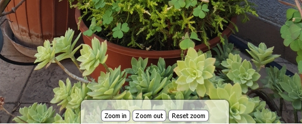

-   Move to *"data provided"*

    -   This event is available with an *"open"* status. It allows you
        > to move the task to *"data provided"* status.

    -   After pressing the Move button, a dialog box is displayed, where
        > it is possible to enter a comment, and after pressing OK, the
        > action will be performed.

    -   The result of the action is the setting of the status *"data
        > provided".*

> 

-   Delete

    -   This action is available with the status *"new".* It allows you
        > to delete a task.

    -   After pressing the Delete button, a dialog box is displayed,
        > where after pressing OK the action is performed.

    -   The result of the action is deleting of the task.

    -   Verification of photos

    -   The *Examined* column graphically shows whether the photo checks
        > were OK or not. This involves checking the correctness of the
        > position and checking the originality of the photo.

    -   View complete photo review information

    -   The table of photo data shows the results of the performed
        > checks in color.

## Super-administrator

After logging in, the Agency management page is displayed.

**  
  
Fig. 53 Agency management  
**

### Agency list

This page offers the following features:

1.  Add new agency

> 

-   Clicking on the button displays a table in which it is necessary to
    > fill in the name of the new agency. The creation of the agency is
    > confirmed by pressing the Save button.

> 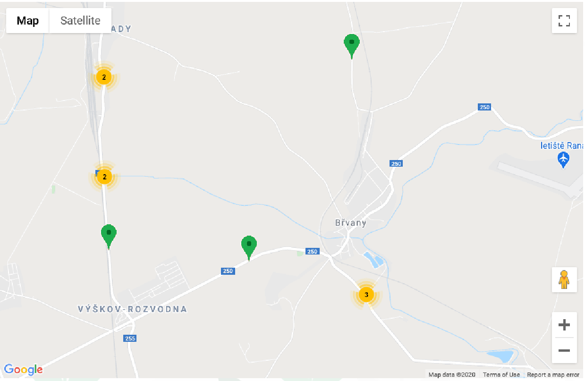

2.  Open detail of the agency by clicking on a row of specified agency.

### Agency detail

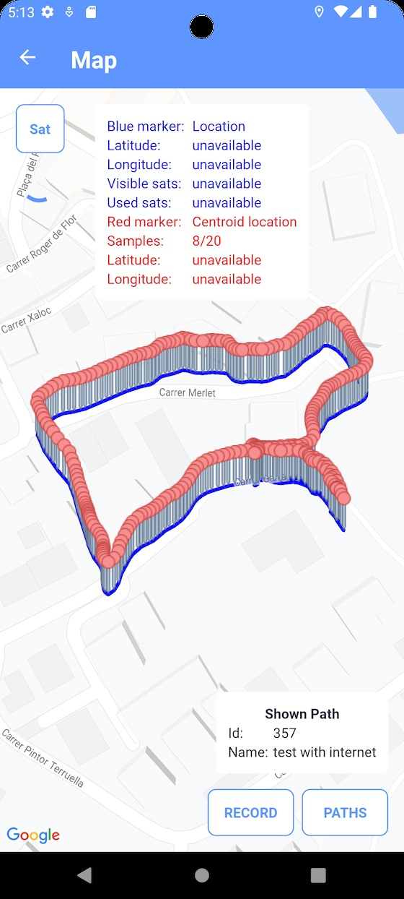

**Fig. 54 Officers management**

1.  Add a new officer  
    >   
    > 

-   By clicking on the button, a table is displayed in which it is
    > necessary to fill in the data of the new officer. The creation of
    > a new officer is confirmed by pressing the Save button.

-   The entered login and password will be used by the user to access
    > the application.

> 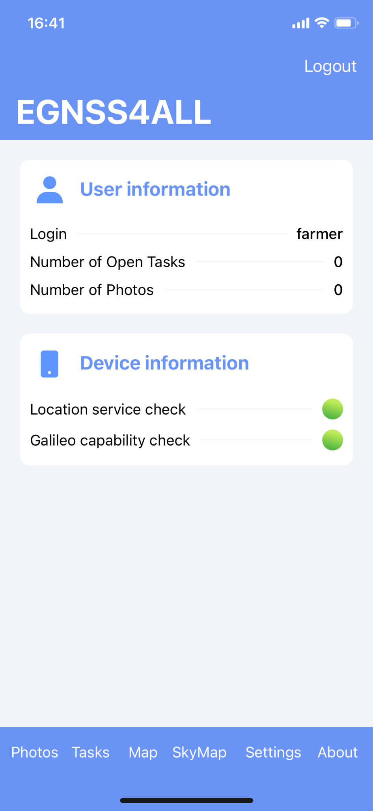

2.  Edit an existing officer

> 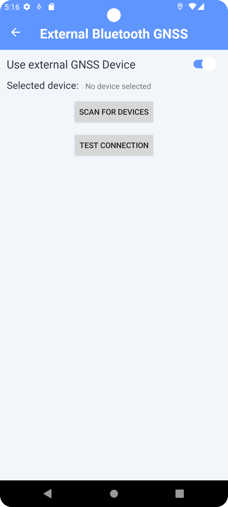

-   Clicking the button displays the same table as when creating a new
    > officer. In this case, the table is pre-populated with the data of
    > the selected officer. The data can be edited in the table (except
    > for the login) and their modification can be confirmed with the
    > Save button.

-   If the password field is left blank, the password remains the same.

3.  Deactivate an existing officer

> 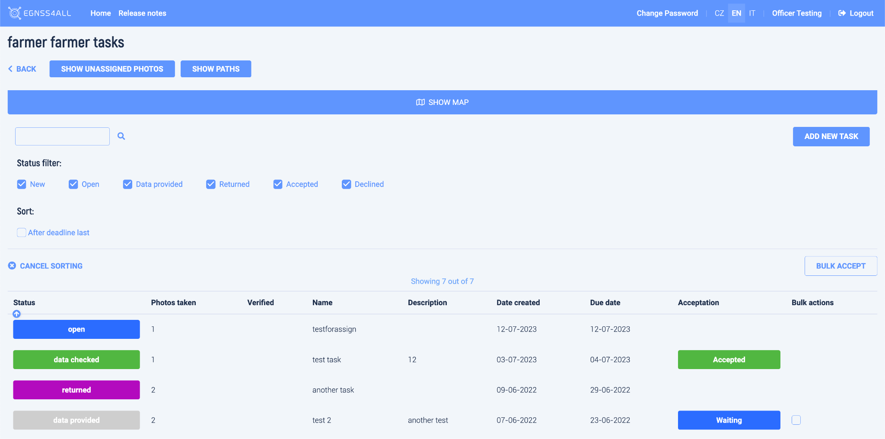

-   After pressing the Deactivate button, a dialog box is displayed,
    > where after pressing OK the action is performed.

-   The result of the action is deactivation of the selected officer.

-   The deactivated officer will be no more able to log in into
    > application.

4.  # Annex: Hosting and installing the EGNSS4ALL web console

    1.  ## Hosting requirements

-   Php7 engine

-   MySQL 8 database server

-   Apache2 web server

    1.  ## Server resources requirements

-   min 8GB RAM

-   min 2 core cpu

-   min 10GB disk space

    1.  ## Installation steps for the webconsole

-   copy the web console files into the selected webroot directory

-   create VirtualHost section in the Apache2 configuration and point it
    > to selected directory

-   make sure that there is set a directive DirectoryIndex index.php

-   write the database name, database user and the corresponding
    > password into the web console configuration file

-   run [<u>http://your-domain.tld</u>](http://your-domain.tld/)
